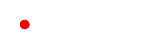

# canvasgen

A zero-dependency animation library for creating complex scenes and animation timelines to paint on HTML canvas. It is specifically designed for writing seekable animations programatically.

`canvasgen` is:
- **Minimalist:** It just gives you the building blocks. You can pick and choose, and you decide exactly when and what gets drawn on the canvas.
- **Ergonomic:** A simple API makes it easy to build and reason about animations. You can split up your logic in a way that fits your design, and write highly reusable code.
- **Composable:** Build complex animations by plugging simple ones together. The library provides combinators like `SequenceAnimation`, `StaggeredAnimation`, and `ArrayAnimation` to run animations in order, offset in time, or all at once.
- **Runtime-agnostic:** This code is just TypeScript, with no dependencies, it can be run in the browser or the server. You can swap out the `CanvasRenderingContext2D` implementation with one that runs on the server (like `@napi-rs/canvas`, `skia-canvas`, etc.), and run the exact same code to get the same result.

The core logic has **zero dependencies**. It can be used with any `CanvasRenderingContext2D` implementation, both in the browser or on the server (e.g., with `@napi-rs/canvas`, `skia-canvas`, or others). You don't even have to import it as a package, you can just copy and paste the code from this repo.

## Core Concepts

At `canvasgen`'s core is the `Animation<T>`, which you can evaluate at a point in time, giving a value of type `T`. The `Animation` implementation can determine its value however it wants, and there are lots of utilities to create `Animation`s.

With the method `.derive()`, you can transform an animation's output (just like `Array.prototype.map`). For example, you can take a source `Animation<number>` and make an `Animation<string>` out of it, by passing in a `(value: number) => string`.

A `Duration` is a unit of time, represented internally as frames. This is used both as a *point in time* (e.g., "frame 60") or a *length of time* (e.g., "60 frames long").

`Painter` is just a type alias to `(context: CanvasRenderingContext2D) => void`, that usually means a function that performs drawing operations. This is useful for passing these functions around, and for writing `Animation<Painter>`, which is an animation that at any point in time can draw something on a canvas.

## Usage

Here's what `canvasgen` looks like in practice:

```ts
import { Duration, SequenceAnimation, ArrayAnimation, Animation, Painter } from "./lib/core.ts";
import { tweenNumber, createCirclePainter } from "./lib/std.ts";
import { easings } from "./lib/easings.ts";

// An animation for a number that moves from 50 to 250 over 60 frames
const xPositionAnimation = tweenNumber({
	from: 50,
	to: 250,
	duration: new Duration(60),
	easing: easings.easeInOut,
});

// A separate animation for a radius, with two parts, each 30 frames long
const radiusAnimation = new SequenceAnimation([
	tweenNumber({ from: 10, to: 30, duration: new Duration(30), easing: easings.easeOut }),
	tweenNumber({ from: 30, to: 10, duration: new Duration(30), easing: easings.easeOutBounce }),
]);

// Evaluating these would give:
xPositionAnimation.at(new Duration(0)); // 50
xPositionAnimation.at(new Duration(30)); // 150 (at halfway through)
radiusAnimation.at(new Duration(30)); // 30 (the end of the first part)
radiusAnimation.at(new Duration(60)); // 10 (the end of the second part)

// Run the two animations in parallel
// This turns the Animation<number>[] into an Animation<number[]>
const mainAnimation = new ArrayAnimation([xPositionAnimation, radiusAnimation]);

mainAnimation.at(new Duration(0)); // [50, 10]
mainAnimation.at(new Duration(36)); // [186, 29.2]

// Derive a new animation that evaluates to a Painter
const painterAnimation = mainAnimation.derive<Painter>(([x, radius]) => {
	return createCirclePainter({
		center: { x, y: 50 },
		radius,
		fillStyle: "red",
	});
});

painterAnimation.at(new Duration(0)); // Function (anonymous)

// You can now use it to draw on a canvas for any given frame
function drawFrame(context: CanvasRenderingContext2D, frame: number): void {
	const painter = painterAnimation.at(new Duration(frame));
	context.clearRect(0, 0, context.canvas.width, context.canvas.height);
	painter(context);
}

```

Here's what that animation looks like:



As it's rendered at 60 FPS, it takes one second to play.

## Performance and optimizations

The animation objects are designed so that at runtime, the code runs in two passes: once when the animations are created, and once when they are evaluated. The creation should happen when the *configuration* of the animation changes, and the evaluation happens on each frame.

If you have expensive computations, like deciding the layout of elements or the duration of a scene, that probably only needs to happen when the animation is created, and the evaluation logic can run much faster.

Creating new `Animation` objects will most likely create closures, though this depends on how you're using the library. The results of creation logic are stored in these closures, so the more `Animation`s you create and the more information you store when creating them, the more memory you'll use. Keep this in mind when creating animation configurations based on user input.

---

This library also provides a mechanism for short-circuiting the evaluation. You can ask an `Animation` if it evaluates to the same value at two points in time, without evaluating anything. Depending on your use case, this can save you the cost of evaluating the animation, but also the cost of whatever operation you would do with a new value. For example, if you are drawing the animation on a canvas, and the current frame is the same as the last, you can just skip it!

```ts
if (animation.isSameAt(new Duration(cachedFrame), new Duration(frame))) {
	return;
}
cachedFrame = frame;
```

This is needed because two `Painter` functions cannot be meaningfully compared, but it's actually better than just comparing the outputs, since we can skip more this way.

All of the library's animation primitives support this method, but it will only return `true` when it is completely certain that the animation cannot have a different value at the two given points. For example: a `ConstantAnimation` is the same everywhere. It returning `false` *doesn't guarantee* that the values will be different.

When using `.derive()`, you get this functionality for free. As long as the callback you give to `.derive` is a pure function, the output cannot depend on anything but the value of the source function, so `.isSameAt()` will be the same as on the source.

For most browser-based canvas applications however, this optimization is not needed, you will probably get great performance just drawing every frame. In fact, if you know in advance that your animations will change on most frames, then this would just result in unnecessary work being done in addition to drawing.

## Other helpers

- `colors.ts`: RGBA and HSLA color parsing and interpolation utilities.
- `easings.ts`: A collection of common easing functions.

## Other projects

This library is partially inspired by the [Tween API in Flutter](https://api.flutter.dev/flutter/animation/Tween-class.html), and the [motion-canvas project](https://github.com/motion-canvas/motion-canvas).

## Examples

There are two examples provided in the `examples/` folder.

### Browser Demo

This demo runs a Vite dev server and lets you scrub through an animation with a slider.

```bash
# Install dependencies (for Vite)
deno install

# Run the browser demo
deno task dev
```

### Server-side Demo

This demo uses `@napi-rs/canvas` and FFMpeg to render an animation to an `.mp4` file, showing how the same animation code can be used on the server.

```bash
# Install dependencies (for @napi-rs/canvas)
deno install

# Run the server-side rendering task
deno task render
```

This will create a `text-scene.g.mp4` file in the root directory.
